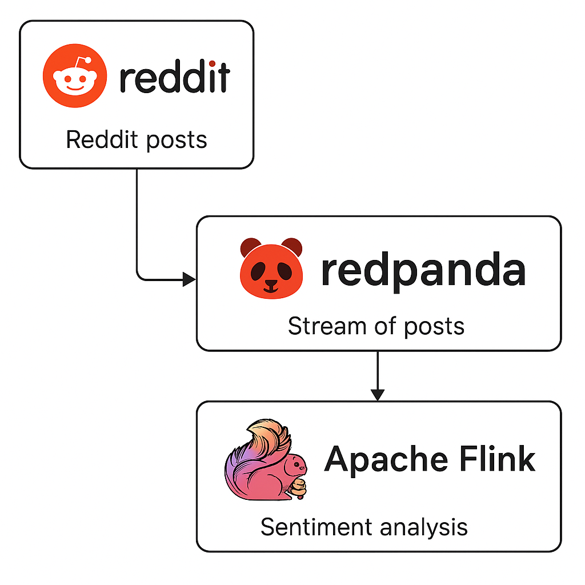
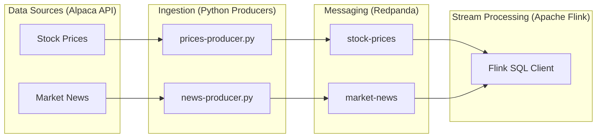

# Streaming Algorithmic Trading Pipeline

A robust, real-time data pipeline designed for algorithmic trading, integrating data ingestion, sentiment analysis, and stream processing.



## Overview

This project implements a complete pipeline that fetches stock prices and market news, processes them in real-time, and makes them available for analysis or trading algorithms. It leverages modern streaming technologies to ensure low latency and high throughput.

## Architecture

The system is built on a microservices architecture:



### Components

*   **Ingestion Layer**: Python scripts (`news-producer.py`, `prices-producer.py`) fetch data from the Alpaca API.
    *   `news-producer.py`: Collects market news and performs sentiment analysis using NLTK VADER.
    *   `prices-producer.py`: Collects historical stock price bars.
*   **Messaging Layer**: [Redpanda](https://redpanda.com/) acts as a high-performance, Kafka-compatible message broker.
*   **Processing Layer**: [Apache Flink](https://flink.apache.org/) processes the data streams using SQL for real-time analytics.

## Technology Stack

*   **Python 3.9+**: Data producers and sentiment analysis.
*   **Redpanda (Kafka API)**: Message streaming.
*   **Apache Flink 1.19**: Stream processing.
*   **Docker & Docker Compose**: Containerization and orchestration.
*   **Alpaca API**: Financial market data source.

## Getting Started

### Prerequisites

*   Docker and Docker Compose
*   Python 3.9+
*   Alpaca API Keys (Free tier available)

### Configuration

1.  Create a directory `alpaca_config` in the root (this is gitignored).
2.  Create `alpaca_config/keys.py` with your credentials:

```python
config = {
    'key_id': 'YOUR_ALPACA_KEY_ID',
    'secret_key': 'YOUR_ALPACA_SECRET_KEY',
    'base_url': 'https://paper-api.alpaca.markets',  # or live URL
    'redpanda_brokers': ['localhost:9092']
}
```

### Installation & Running

1.  **Start Infrastructure**:
    ```bash
    docker-compose up -d
    ```
    This spins up Redpanda, Flink JobManager, Flink TaskManager, and Flink SQL Client.

2.  **Install Python Dependencies**:
    ```bash
    pip install kafka-python alpaca-trade-api alpaca-py nltk
    ```
    **Sentiment Analysis Setup**:
    If you encounter an error about missing NLTK data, run this once:
    ```bash
    python -c "import nltk; nltk.download('vader_lexicon')"
    ```

3.  **Run Producers**:
    Open separate terminals to run the producers:

    ```bash
    # Produce stock prices
    python prices-producer.py

    # Produce market news with sentiment
    python news-producer.py
    ```

4.  **Analyze with Flink SQL**:
    To access the Flink SQL client (note: use `run` instead of `exec` if the container has exited):
    ```bash
    docker-compose run --rm sql-client
    ```
    
    Inside the SQL client, define your tables using the queries in `ddl.sql` (copy-paste them), then query your data:
    ```sql
    -- Example queries
    SELECT * FROM market_news;
    SELECT * FROM stock_prices;
    ```

## Project Structure

*   `news-producer.py`: Producer for news data.
*   `prices-producer.py`: Producer for stock price data.
*   `utils.py`: Helper functions (sentiment analysis).
*   `ddl.sql`: Flink SQL table definitions.
*   `docker-compose.yml`: Infrastructure orchestration.
*   `Dockerfile-sql`: Custom Flink image with Kafka connectors.